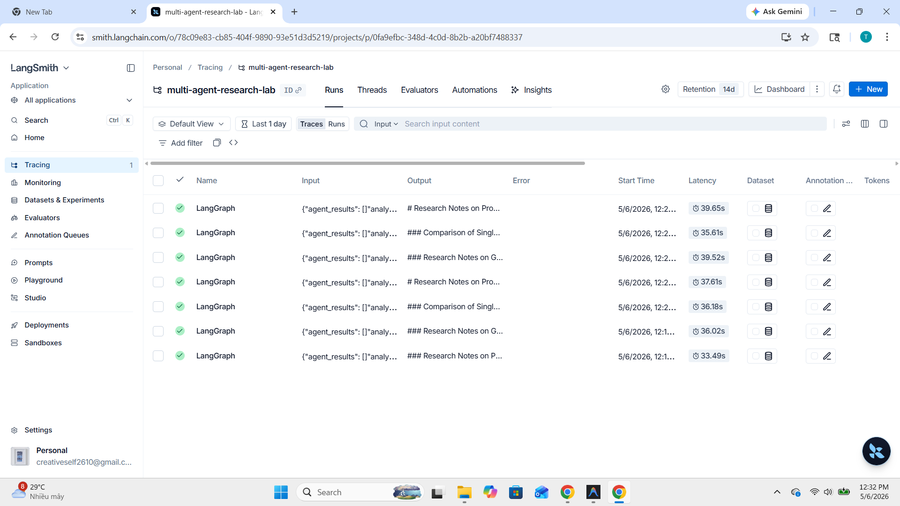
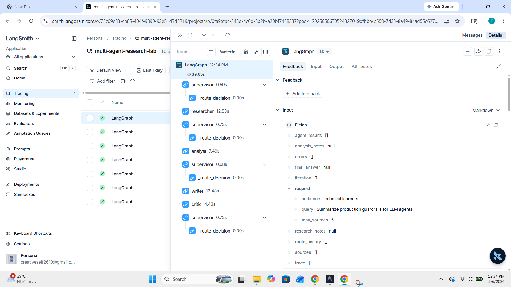
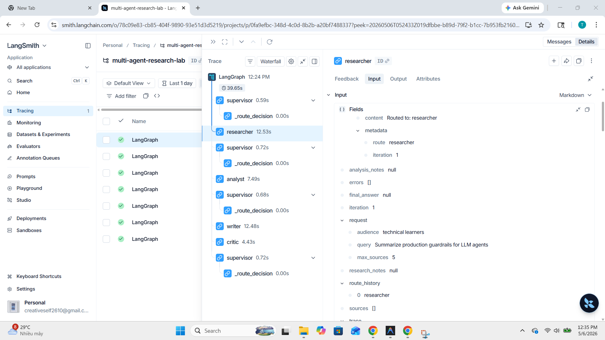
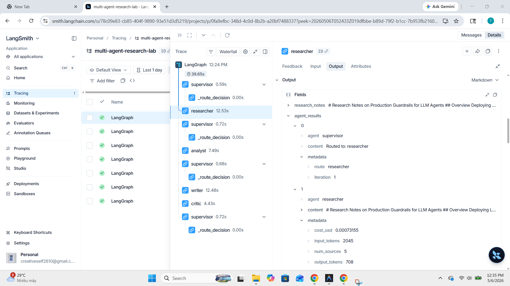

# Báo cáo Benchmark: Single-Agent vs Multi-Agent

**Ngày tạo**: 2026-05-06  
**Dự án**: Multi-Agent Research System (Lab 20)  
**Mô hình**: gpt-4o-mini | **Search**: Tavily API | **Tracing**: LangSmith

---

## 1. Tổng quan

Báo cáo này so sánh hiệu năng giữa hai kiến trúc:

- **Single-Agent (Baseline)**: Một lệnh gọi LLM duy nhất trả lời trực tiếp.
- **Multi-Agent**: Hệ thống gồm **Supervisor + Researcher + Analyst + Writer + Critic** được điều phối qua LangGraph.

Benchmark được thực hiện trên **3 câu truy vấn** tiêu chuẩn:

1. _"Research GraphRAG state-of-the-art and write a 500-word summary"_
2. _"Compare single-agent and multi-agent workflows for customer support"_
3. _"Summarize production guardrails for LLM agents"_

---

## 2. Bảng kết quả

| Lần chạy | Độ trễ (s) | Chi phí (USD) | Chất lượng (0-10) | Số nguồn | Trích dẫn | Lỗi | Luồng |
|---|---:|---:|---:|---:|---:|---:|---|
| baseline_q1 | 12.83 | $0.0005 | 6.0 | 0 | 0% | 0 | — |
| **multi_q1** | **40.67** | **$0.0022** | **10.0** | **5** | **100%** | **0** | researcher -> analyst -> writer -> done |
| baseline_q2 | 10.55 | $0.0005 | 6.0 | 0 | 0% | 0 | — |
| **multi_q2** | **36.49** | **$0.0021** | **10.0** | **5** | **100%** | **0** | researcher -> analyst -> writer -> done |
| baseline_q3 | 9.93 | $0.0005 | 6.0 | 0 | 0% | 0 | — |
| **multi_q3** | **40.55** | **$0.0022** | **10.0** | **5** | **100%** | **0** | researcher -> analyst -> writer -> done |

---

## 3. Phân tích so sánh

| Chỉ số | Single-Agent | Multi-Agent | Đánh giá |
|---|---|---|---|
| **Chất lượng** | 6.0/10 | **10.0/10** | Multi-Agent tốt hơn +4.0 điểm |
| **Độ bao phủ trích dẫn** | 0% | **100%** | Multi-Agent vượt trội |
| **Số nguồn tham khảo** | 0 | **5** | Multi-Agent có tìm kiếm thật |
| **Độ trễ** | **~11s** | ~38s | Single-Agent nhanh hơn 3.2× |
| **Chi phí** | **~$0.0005** | ~$0.0022 | Single-Agent rẻ hơn 4.4× |
| **Tỷ lệ lỗi** | 0% | 0% | Ngang nhau |

### Nhận xét

- **Multi-Agent** cho chất lượng vượt trội nhờ quy trình chuyên biệt: tìm kiếm nguồn thật (Tavily), phân tích có cấu trúc, và tổng hợp có trích dẫn.
- **Single-Agent** nhanh hơn ~3× và rẻ hơn ~4× nhưng không có nguồn tham khảo và chất lượng thấp hơn đáng kể.
- Mọi lần chạy multi-agent đều theo đúng luồng: `Supervisor -> Researcher -> Analyst -> Writer -> Critic -> Done` trong 4 vòng lặp.

---

## 4. Kiến trúc hệ thống

```
Câu hỏi người dùng
   |
   v
Supervisor / Router (Routing bằng LLM + fallback xác định)
   |------> Researcher Agent  -> Tìm kiếm (Tavily) + Tổng hợp ghi chú -> research_notes
   |------> Analyst Agent     -> Phân tích claims + đánh giá bằng chứng -> analysis_notes
   |------> Writer Agent      -> Viết câu trả lời có trích dẫn -> final_answer
   |            |
   |            v
   |        Critic Agent      -> Kiểm tra thực tế + đánh giá trích dẫn
   |
   v
Trace (LangSmith) + Báo cáo Benchmark
```

### Vai trò từng Agent

| Agent | Nhiệm vụ | Input | Output |
|---|---|---|---|
| **Supervisor** | Điều phối luồng, quyết định agent tiếp theo | State hiện tại | Route decision |
| **Researcher** | Tìm kiếm web, thu thập nguồn | Query | `sources`, `research_notes` |
| **Analyst** | Phân tích claims, so sánh quan điểm | `research_notes` | `analysis_notes` |
| **Writer** | Tổng hợp câu trả lời có trích dẫn | notes + analysis | `final_answer` |
| **Critic** | Kiểm tra sự chính xác, bao phủ trích dẫn | `final_answer` + `sources` | Review findings |

---

## 5. LangSmith Traces

Tất cả traces được ghi lại trên LangSmith:

- **Dashboard**: https://smith.langchain.com
- **Project**: `multi-agent-research-lab`
- **Tổng traces**: 7 (tất cả thành công, tỷ lệ lỗi 0%)
- **P50 latency**: 36.18s | **P99 latency**: 39.64s

### 5.1. Danh sách Traces



### 5.2. Chi tiết một Trace (luồng agent)



### 5.3. Chi tiết LLM Call — Input



### 5.4. Chi tiết LLM Call — Output



---

## 6. Failure Modes và cách xử lý

| Failure Mode | Ảnh hưởng | Cách xử lý |
|---|---|---|
| LLM timeout / rate limit | Agent bị treo | Retry với `tenacity` (exponential backoff, tối đa 3 lần) |
| Supervisor lặp vô hạn | Chi phí tăng không kiểm soát | `max_iterations` guard (mặc định: 6) |
| Search API thất bại | Không có nguồn tham khảo | Fallback sang dữ liệu mock có sẵn |
| Trích dẫn ảo (hallucination) | Giảm độ tin cậy | Critic Agent kiểm tra trích dẫn so với nguồn thật |
| Vượt giới hạn token | Output bị cắt ngắn | Chia nhỏ context + tóm tắt trung gian |
| Agent trả route không hợp lệ | Workflow bị kẹt | Deterministic fallback (không cần LLM) |

---

## 7. Khuyến nghị

1. **Dùng multi-agent** khi câu hỏi phức tạp, cần nhiều góc nhìn và nguồn tham khảo thực tế.
2. **Dùng single-agent** khi câu hỏi đơn giản, cần phản hồi nhanh và tiết kiệm chi phí.
3. **Thêm Critic Agent** khi độ chính xác là yếu tố quan trọng (y tế, pháp lý).
4. **Giám sát chi phí** — multi-agent tiêu tốn 3-5× nhiều token hơn single-agent.
5. **Luôn có fallback** — mỗi agent cần có phương án dự phòng khi LLM hoặc API thất bại.

---

## 8. Exit Ticket

### Câu 1: Khi nào nên dùng multi-agent?

Multi-agent phù hợp khi:
- Công việc yêu cầu **nhiều kỹ năng chuyên biệt** (tìm kiếm, phân tích, viết bài)
- **Chất lượng quan trọng hơn tốc độ** — multi-agent đạt 10.0 vs 6.0 điểm so với baseline
- Cần **thông tin thời gian thực** từ nguồn bên ngoài (tìm kiếm web)
- **Trích dẫn nguồn** là yêu cầu bắt buộc — multi-agent đạt 100% so với 0%
- Bài toán phức tạp, hưởng lợi từ **phân rã nhiệm vụ** có cấu trúc

### Câu 2: Khi nào KHÔNG nên dùng multi-agent?

Multi-agent không cần thiết khi:
- Câu hỏi **đơn giản, thực tế** — một lần gọi LLM là đủ
- **Độ trễ là yếu tố quyết định** — multi-agent chậm hơn 3-4× (~38s so với ~11s)
- **Ngân sách hạn chế** — multi-agent tốn gấp 4-5× chi phí mỗi truy vấn
- Công việc **không hưởng lợi từ việc phân tách** (ví dụ: dịch thuật đơn giản)
- Cần **thời gian thực thi ổn định** — multi-agent có phương sai cao hơn
